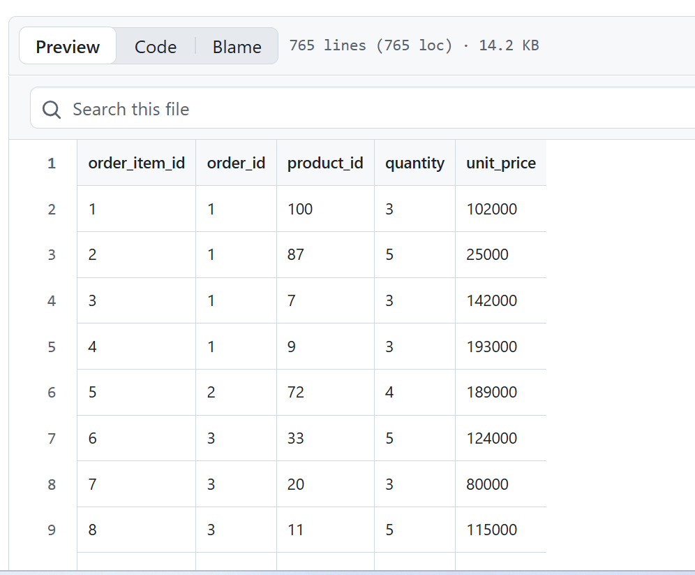
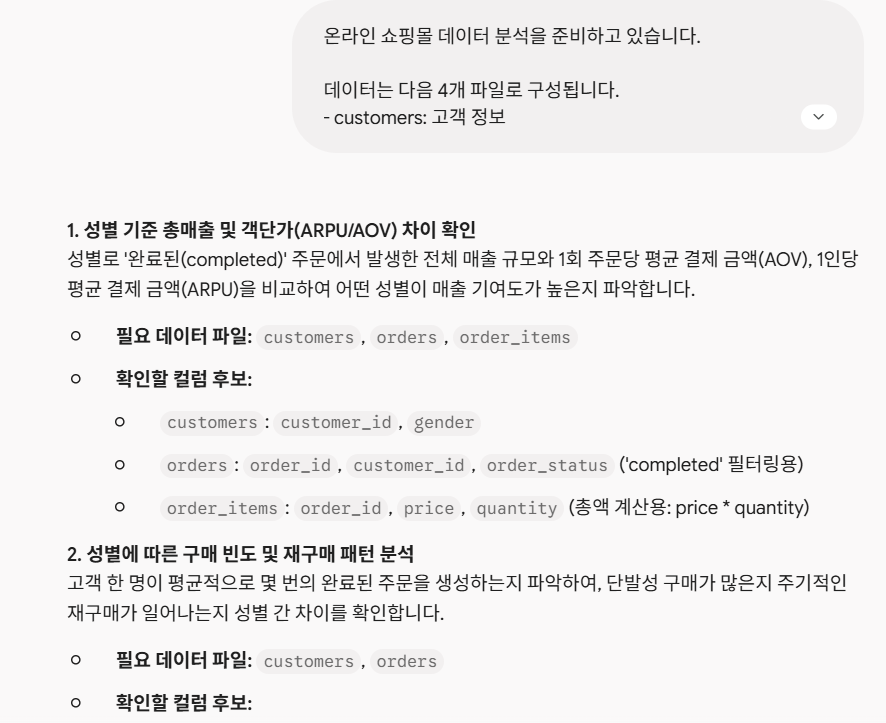
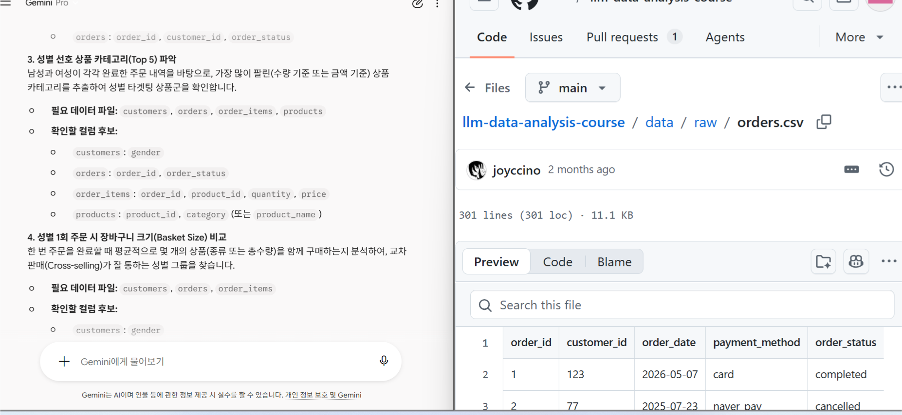
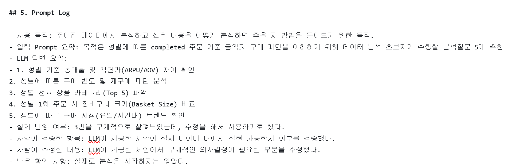
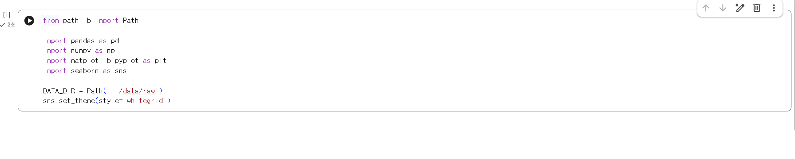

# Chapter 01 제출 답안. AI와 함께하는 데이터 분석의 시작

> 이 파일은 Chapter 01 실습 결과를 정리하여 제출하기 위한 학생용 템플릿입니다.  
> 강사 저장소의 원본 템플릿을 직접 수정하지 말고, 자신의 PC에 복사한 뒤 작성합니다.

---

## 0. 제출 정보

- 이름: 최종인
- GitHub ID: JONG-IN-01
- 개인 저장소명: `llm-data-analysis-study`
- 작성일: 2026-09-05
- 사용한 LLM: Gemini

### 최종 제출 URL

```text
https://github.com/JONG-IN-01/llm-data-analysis-study/blob/main/chapter1/chapter1
```

---

## 1. 원래 업무 질문

### 내가 선택한 막연한 질문

```text
최근 매출 성장률이 낮아진 이유는 무엇이야?
```

### 왜 이 질문이 모호하다고 생각했는가?

- 대상: 매출이 다양한 상품 또는 제품의 특정 매출일 수 있고 기업 전체의 매출일 수도 있다.
- 기간: 최근이라는 단어는 질문을 받는 사람의 기준에 따라 다르다.
- 기준: 분기별인지 반기별인지 사업연도별 매출성장률인지 기준이 모호하다.
- 비교 방법: 분기별로 월별 증가율인지 분기별로 분기별 증가율인지 모호하다.
- 분석 목적: 매출 성장의 감소가 특정 제품 또는 상품에 집중되는지 특정 월에만 집중되는지 확인하는 것인지 목적이 모호하다.

### 분석 가능한 질문으로 다시 작성

```text
2026년 1분기 상품별 매출성장률과 2분기 상품별 매출성장률이 어떻게 변했으며,
매출성장률의 감소가 특정 상품에 집중되어 있는가?
```

### 결과 관찰

최근이라는 단어가 2026년 1분기와 2분기로 구체화 되었으며 매출이 상품별 매출이라는 것으로 구체화되었고,
분기당 매출 성장율의 감소가 특정 상품에 집중되어있는지 분석 목적을 구체화하였다.

### 나의 해석과 판단

매출성장률이 감소를 하였을 때는 구체적으로 어떤 상품에서 매출이 감소를 했는지 파악을 해야 
의사결정자 입장에서 효율적인 의사결정이 가능하기 때문이다.

### 업무·분석적 의미

매출성장률의 감소가 특정 제품에 몰려있는지 확인할 수 있고, 문제점을 파악하여 신속하게 대처할수 있다. 
예를 들어, 특정 제품의 광고를 더 추가로 한다던지 특정 제품의 매출이 감소하는 이유를 파악하여 소비자들이 어떤 상품을 선호하는지 파악할 수 있다.

### 한계와 추가 확인 사항

매출성장률만으로 어떤 상품의 잠재적인 성장을 완벽하게 파악할 수는 없을 것이다. 추가로 매출금액, 반품율, 제품별 영업이익률 등 다양한 경영지표를 고려하여
의사결정을 해야할 것이다.

### Evidence


LLM을 사용하지 않아 사진은 첨부하지 않았습니다. 
---

## 2. 질문과 필요한 데이터 연결
1번은 그냥 모호한 질문만 생각했고, 
2번부터 적용할 질문은 성별에 따른 카테고리별 completed 주문금액 비교하고 싶다.입니다.

### 필요한 데이터 파일

- [ ] `customers.csv` 
- [ ] `products.csv`
- [ ] `orders.csv`
- [ ] `order_items.csv`
모두 필요하다.

### 필요한 컬럼 후보

customers.gender
customers.customer_id
orders.customer_id
orders.order_status
orders.order_id
order_items.order_id
order_items.product_id
products.product_id
products.category
order_items.quantity
order_items.unit_price

### 데이터 연결 관계

```text
customers.customer_id / orders.customer_id
orders.order_id/order_items.order_id
order_items.product_id/products.product_id
PK/FK관계로 연결이 필요하다.
```

### 결과 관찰

질문:성별에 따른 카테고리별 completed 주문금액 비교하고 싶다이기 때문에 성별과 카테고리별로 completed한 주문금액을 합쳐야했기 떄문에
성별과 카테고리 completed한 상태를 알려주는 열이 있는지 파악이 필요했고 해당 열들을 연결해줄 수 있는 기본키, 외래키 등이 필요했다.
또한 금액을 알아야했기 때문에 유닛당 금액과 양(개수)를 파악해야했다.

### 나의 해석과 판단

현재 데이터만으로 파악할 수 있다고 생각한다.

### 업무·분석적 의미

질문과 데이터 구조를 먼저 연결하는 것은 질문에 대한 답변을 해당 데이터를 기반으로 충분히 해낼 수 있는지를 파악하기 위해서 중요하다.

### 한계와 추가 확인 사항

데이터 타입과 결측치와 잘못 입력된 값들을 모두 확인하지 못했고 열의 유무로만 판단했다.

### Evidence


---

## 3. LLM에게 분석 질문 후보 요청

### 사용 목적

```text
초보 데이터 분석가이기 때문에 어떤 방법으로 데이터를 분석할 지 조언을 구하기 위해 LLM을 사용하였다.
```

### 사용한 Prompt

```text
온라인 쇼핑몰 데이터 분석을 준비하고 있습니다.

데이터는 다음 4개 파일로 구성됩니다.
- customers: 고객 정보
- products: 상품 정보
- orders: 주문 정보
- order_items: 주문 상세 정보

목적은 성별에 따른 completed 주문 기준 금액과 구매 패턴을 이해하는 것입니다.

초보 데이터 분석자가 먼저 확인할 분석 질문 5개를 제안해 주세요.
각 질문마다 필요한 데이터 파일과 확인할 컬럼 후보도 적어 주세요.
원인을 단정하지 말고, 현재 데이터로 확인 가능한 질문만 제안해 주세요.
```

### LLM 답변 요약

LLM의 전체 답변을 그대로 복사하지 말고 핵심 제안 3~5개를 요약하세요.

1. 성별 기준 총매출 및 객단가(ARPU/AOV) 차이 확인
2. 성별에 따른 구매 빈도 및 재구매 패턴 분석
3. 성별 선호 상품 카테고리(Top 5) 파악
4. 성별 1회 주문 시 장바구니 크기(Basket Size) 비교
5. 성별에 따른 구매 시점(요일/시간대) 트렌드 확인

### 결과 관찰

5개 모두 성별에 따라 비교할 수 있는 질문을 주었고, 2개는 주문 금액 관련(위 요약 1,4번) 3개는 구매 패턴 등을 알 수 있는 질문을 주었다.(2,3,5번)


### 나의 해석과 판단

좋았던 제안 : 성별 기준 총매출 및 객단가 차이 확인, 성별에 따른 구매시점 트렌드 및 재구매 패턴 분석, 카테고리 파악이 있었고
사용하기 어려운 제안: 1회 주문시 장바구니 크기 비교는 성별기준 총매출 및 객단가 차이 확인과 비슷하다고 생각했다.

### 업무·분석적 의미

LLM이 분석 시작 단계에서 나의 데이터 분석 목적에 따른 다양한 방식, 시각들을 제공해준다고 생각한다. 특히 저년차로 일을 막 시작한 사람에게는
도움이 될 수 있다고 생각한다.

### 한계와 추가 확인 사항
LLM에게 실제 데이터를 제공하지 않았기 때문에 이상적인 데이터 분석방향을 이야기하지만 내가 가지고 있는 데이터 파일에서 실제로 그 분석을
실행할 수 있을 것인지 확인하는 과정이 필요하다.

### Evidence



---

## 4. LLM 제안 검증

LLM 제안 중 하나 이상을 선택해 검토합니다.

| 검증 항목 | 확인 내용 |
| --- | --- |
| 선택한 LLM 제안 |  |
| 필요한 파일 |  |
| 필요한 컬럼 |  |
| 계산 범위 |  |
| 실제 데이터 확인 필요 여부 |  |
| 원인 단정 여부 |  |
| 최종 판단 | 사용 / 수정 후 사용 / 보류 |

### 내가 수정한 내용

```text
LLM 제안을 수정했다면 무엇을 어떻게 바꿨는지 작성하세요.
```

### 결과 관찰

검증 과정에서 확인된 사실을 작성하세요.

### 나의 해석과 판단

왜 `사용 / 수정 후 사용 / 보류` 중 해당 결정을 내렸는지 작성하세요.

### 업무·분석적 의미

LLM 제안을 검증하지 않고 바로 사용하는 경우 어떤 문제가 생길 수 있는지 작성하세요.

### 한계와 추가 확인 사항

아직 실제 데이터로 검증하지 못한 부분을 명확히 작성하세요.

### Evidence



---

## 5. Prompt Log

- 사용 목적:
- 입력 Prompt 요약:
- LLM 답변 요약:
- 실제 반영 여부:
- 사람이 검증한 항목:
- 사람이 수정한 내용:
- 남은 확인 사항:

### 결과 관찰

LLM 사용 기록에서 어떤 의사결정 과정을 확인할 수 있는지 작성하세요.

### 나의 해석과 판단

Prompt Log를 남기는 것이 왜 필요한지 자신의 말로 작성하세요.

### Evidence



---

## 6. 개인정보와 Secret 보호 확인

다음 항목을 확인합니다.

- [ ] 실제 이름·이메일·전화번호 등 고객 개인정보를 Prompt에 사용하지 않았습니다.
- [ ] API Key를 코드나 Notebook에 직접 작성하지 않았습니다.
- [ ] `.env` 실제 내용을 캡처하거나 업로드하지 않았습니다.
- [ ] GitHub Token, 비밀번호, 내부 URL이 캡처에 보이지 않습니다.
- [ ] 제출 전 이미지까지 다시 확인했습니다.

### 나의 판단

이번 실습에서 어떤 정보는 LLM 또는 Public GitHub에 올리면 안 된다고 판단했는지 작성하세요.

---

## 7. Chapter 01 Notebook 확인

Notebook:

```text
notebooks/ch01_ai_data_analysis_intro.ipynb
```

### 내 환경 상태

- [ ] 아직 환경설정 전이라 Notebook 위치만 확인했습니다.
- [ ] 환경설정이 완료되어 Notebook을 직접 실행했습니다.

### 환경설정 완료 학생만 작성

#### 실행한 코드

```python
from pathlib import Path

import pandas as pd
import numpy as np
import matplotlib.pyplot as plt
import seaborn as sns

DATA_DIR = Path('../data/raw')
sns.set_theme(style='whitegrid')
```

#### 실행 결과

```text
오류 없이 실행되었는지 작성하세요.
```

#### 결과 관찰

실행 결과에서 확인한 사실을 작성하세요.

#### 나의 해석과 판단

현재 Notebook이 본격 분석이 아니라 starter scaffold라는 의미를 자신의 말로 설명하세요.

#### 한계와 추가 확인 사항

Chapter 02 또는 Chapter 03에서 추가로 확인해야 할 내용을 작성하세요.

#### Evidence



> 환경설정 전이라면 이 이미지는 생략할 수 있습니다.

---

## 8. Chapter 01 최종 해석

### 이번 장에서 가장 중요하다고 생각한 내용

```text
자신의 말로 3~5문장 작성하세요.
```

### LLM을 데이터 분석에 사용할 때 가장 조심해야 할 점

```text
자신의 판단을 작성하세요.
```

### 사람과 LLM의 역할 차이

| 항목 | LLM이 도울 수 있는 부분 | 사람이 책임져야 하는 부분 |
| --- | --- | --- |
| 질문 정의 |  |  |
| 데이터 확인 |  |  |
| 코드 작성 |  |  |
| 결과 해석 |  |  |
| 최종 판단 |  |  |

### 다음 Chapter에서 확인하고 싶은 것

```text
이번 장에서 남은 의문이나 Chapter 02~03에서 확인하고 싶은 내용을 작성하세요.
```

---

## 9. 최종 제출 체크리스트

- [ ] 원래 업무 질문과 구체화한 분석 질문을 작성했습니다.
- [ ] 질문에 필요한 데이터 파일과 컬럼 후보를 정리했습니다.
- [ ] LLM Prompt와 답변 요약을 작성했습니다.
- [ ] LLM 제안을 실제 데이터 관점에서 검증했습니다.
- [ ] 각 핵심 STEP의 결과 관찰을 작성했습니다.
- [ ] 각 핵심 STEP의 나의 해석과 판단을 작성했습니다.
- [ ] 업무·분석적 의미를 작성했습니다.
- [ ] 한계와 추가 확인 사항을 작성했습니다.
- [ ] 핵심 실행 Evidence 이미지를 첨부했습니다.
- [ ] 이미지가 Markdown에서 정상 표시됩니다.
- [ ] 개인정보가 없습니다.
- [ ] API Key·Secret·Token이 없습니다.
- [ ] 개인 GitHub 저장소에 업로드했습니다.
- [ ] GitHub에서 Markdown과 이미지가 정상 표시됩니다.
- [ ] 아래 최종 파일 URL이 정상적으로 열립니다.

### 최종 파일 URL

```text
https://github.com/<내-GitHub-ID>/llm-data-analysis-study/blob/main/chapter01/chapter01.md
```

---

## 10. 교수자 확인용 요약

### 수행 상태

- [ ] COMPLETE
- [ ] PARTIAL

### 내가 가장 중요하게 내린 판단 1개

```text
여기에 작성하세요.
```

### 아직 확인이 필요한 내용 1개

```text
여기에 작성하세요.
```
