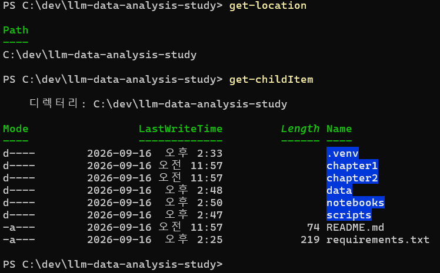
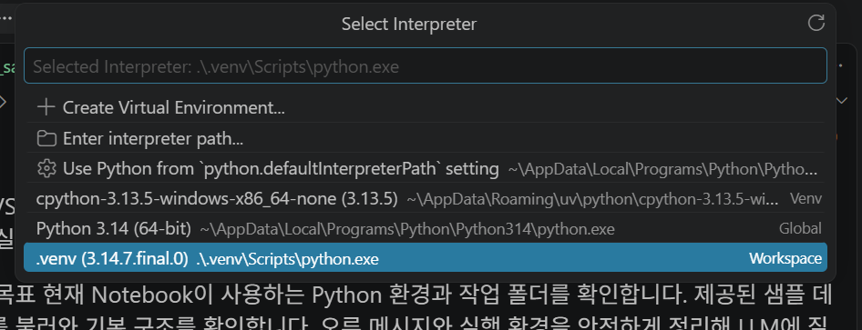
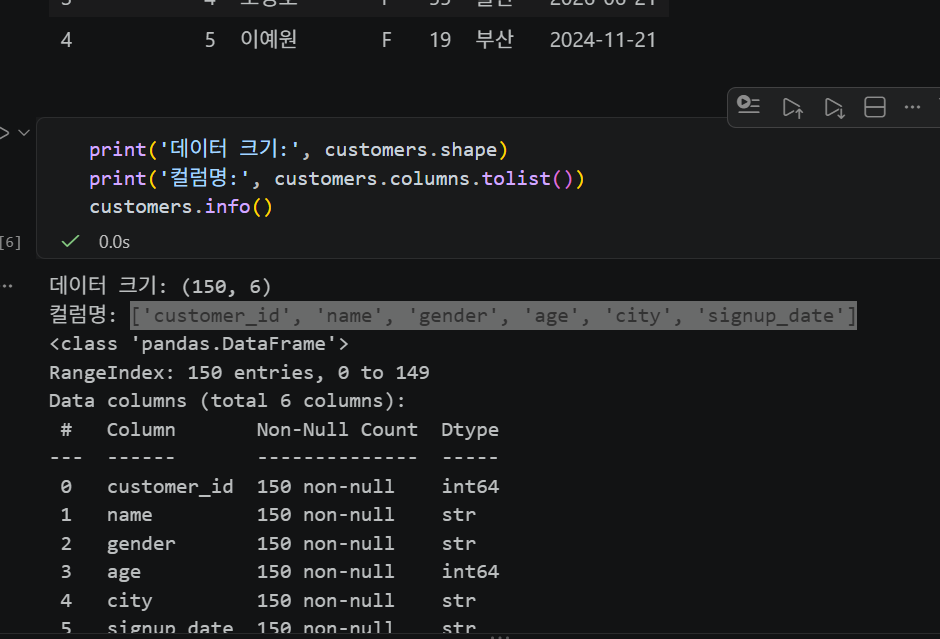
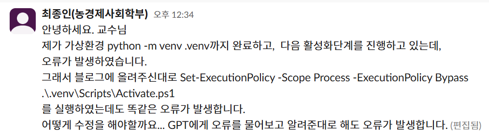

# Chapter 02 제출 답안. VS Code에서 시작하는 데이터 분석 환경

> 최종 파일은 개인 GitHub 저장소의 `chapter02/chapter02.md`로 저장하는 것을 권장합니다.

## 0. 제출 정보

- 이름: 최종인
- GitHub ID: JONG-IN-01
- 개인 저장소: `llm-data-analysis-study`
- 작성일: 2026-09-16
- 운영체제: Windows

### 최종 제출 URL

```text
https://github.com/JONG-IN-01/llm-data-analysis-study/edit/main/chapter2/chapter2.md
```

---

## 1. Python과 Git 환경 확인

### 실행 내용

```text
python --version 또는 py --version
git --version
```

### 실행 결과

```text
python 3.14.7
git version 2.55.0.windows.5
```

### Evidence

.png)
.png)

### 결과 관찰

python의 버전은 3.14.7
git의 버전은 2.55.0 이다.

### 나의 해석과 판단

현재 환경이 학습에 적합하다고 생각한다.
교수님이 수업시간에 언급하신 버전에 가깝기 때문이다.

### 업무·분석적 의미

프로젝트를 실행하는데 무리가 없는지 파악해야하기 때문이다.

### 한계와 추가 확인 사항

실행이 잘 되는지는 아직 파악하지 못했다.

---

## 2. 저장소와 `.venv` 준비

### 수행 내용

- [O] 공식 Public 저장소 clone
- [O] 프로젝트 루트 확인
- [O] `.venv` 생성
- [O] `.venv` 활성화
- [O] `requirements.txt` 설치

### 핵심 실행 결과

```text
현재 프로젝트 경로: c:/dev/llm-data-analysis-study
터미널 Python 실행 파일: 예 모두 완료했습니다. 
가상환경 활성화 여부: 예 모두 완료했습니다.
패키지 설치 결과: 예 모두 완료했습니다.
```

### Evidence



### 결과 관찰

현재 python이 가상환경에서 파일을 실행하고 있다.

### 나의 해석과 판단

프로젝트별로 필요한 패키지를 깔아서 가상환경에서 활용하는 것이 더 유용하기 때문이다. 버전이 달라서 오류가 뜰 위험이 없어진다.


### 업무·분석적 의미

모든 사람이 같은 라이브러리와 버전을 사용해 실행결과의 차이를 줄이기 위해서이다.

### 한계와 추가 확인 사항

python 버전의 차이가 있으면 오류가 발생할 수 있으며, 기관 PC를 이용할 때는 보안정책을 살펴볼 필요가 있다.

---

## 3. VS Code 인터프리터와 Jupyter 커널 연결

### 확인 결과

```text
VS Code Python 인터프리터: ./venv/scripts/python.exe
Notebook sys.executable: c:\dev\llm-data-analysis-study\.venv\Scripts\python.exe
Notebook Path.cwd(): c:\dev\llm-data-analysis-study\notebooks
```

### Evidence


.png)

### 결과 관찰

터미널 Python과 Notebook Python은 같은 .venv이다.

### 나의 해석과 판단

인터프리터가 서로 다르기 때문에 오류가 발생할 것이라고 생각한다.

### 업무·분석적 의미

.venv를 활성화하여 vscode와 jupyter가 같은 python 인터프리터를 사용하게 하여 ModuleNotFoundError와 같은 오류가 발생하는 빈도를 감소시킬 수 있다.

### 한계와 추가 확인 사항
이름이 같더라도 서로 다른 위치의 python에 연결되어 있으면 오류가 발생할 것이다. 정확한 위치를 파악하기 위해서 실행파일의 경로가 어떻게 되는지 파악해야한다.

---

## 4. 샘플 데이터와 Notebook 실행 검증

### 확인 결과

```text
DATA_DIR 존재 여부: 존재한다.
customers.csv 존재 여부: True.
customers.shape: (150,6)
주요 컬럼: ['customer_id', 'name', 'gender', 'age', 'city', 'signup_date']
```

### Evidence



### 결과 관찰

customers.head()에서는 위에서 5행이 나왔다. 이름으로 데이터를 파악하면 김수민, 김정호, 이경수, 조영호, 이예원 순서이다.
shape 는 (150, 6) 으로 나왔는데 150행 6열을 뜻하는 거 같다.
컬럼은 ['customer_id', 'name', 'gender', 'age', 'city', 'signup_date'] 이러한 결과가 나왔다.


### 나의 해석과 판단

csv파일이 정상적으로 연결되었고, 코딩이 작동되는 것을 알 수 있다.

### 업무·분석적 의미

확인을 하여 미리 오류를 파악하여, 제대로된 분석을 시작했을 때의 오류를 줄이고, 오류를 빠르게 파악하기 위해서이다. 

### 한계와 추가 확인 사항

현재는 CSV 연결만 확인이 되었으며, 데이터가 결측치등이 없는지는 파악되지 않았다.
---

## 5. 오류 해결 기록

실습 중 처음에 VScode에서 파워셀을 작동하는데 가상환경을 연결하는 단계에서 Set-ExecutionPolicy -Scope Process -ExecutionPolicy Bypass
.\.venv\Scripts\Activate.ps1를 실행하였는데도 똑같은 오류가 발생하였다. 하지만 VScode를 다시 껐다가 재작동하니 해결되었다.

### 오류 메시지

```text
삭제 해서 오류 메시지를 입력할 수 없습니다.
```

### 원인 후보

1. power shell에서 권한 문제를 해결해야했다.
2.
3.

### 내가 확인한 순서

1. 영어해석을 해보려 노력했다.
2. 강의안을 살펴보았다.
3. Chat-GPT에 물어봤다.

### 해결 방법

```text
chat gpt가 알려준 코드를 작동하고 vscode를 다시 껐다가 작동했더니 해결되었다.
```

### Evidence



### 나의 해석과 판단

강의에서 선생님이 알려주셨다. 강의를 들으면서 실습을 하였기에 바로 원인을 파악할 수 있었다.

### 한계와 추가 확인 사항

다시 껐다가 시도해보는 것을 바로 진행하지 않고 같은 코드를 여러번 시도했던 거 같다. 다양한 방법을 고려해보아야할 것이다.

---

## 6. Secret 보호 확인

- [O] `.env`는 Git 추적 대상이 아닙니다.
- [O] 실제 API Key를 코드에 작성하지 않았습니다.
- [O] 캡처 화면에 Token/비밀번호가 없습니다.
- [O] `.venv`를 Git에 올리지 않습니다.

### Evidence

필요한 경우 `git status`, `.gitignore` 확인 화면을 첨부합니다.


### 나의 해석과 판단

환경 파일과 비밀정보를 분리해야 하는 이유를 작성하세요.

---

## 7. Chapter 02 최종 회고

### 가장 중요했다고 생각한 환경 설정 1가지

```text
가상환경을 활성화하고, vscode와 주피터노트북의 인터프리터를 동일하게 맞추는 것이 중요하다.
```

### 그 이유

```text
그렇지 않으면 오류가 나기 때문이다.
```

### 다음 Chapter에서 재사용할 환경 체크 3가지

1. 인터프리터가 vscode와 주피터 노트북이 동일한 지 확인한다.
2. 가상환경에서의 python을 사용하는지 확인한다.
3. 최소 스모크 테스트를 통해 분석환경과 핵심기능이 작동하는지 파악한다.

### 현재 환경의 한계 또는 주의점

```text
아직 첫 단계라 작동이 미숙하기에 보안에 주의를 기울여야할 것이다. 
```

---

## 최종 제출 체크

- [O] 핵심 Evidence 4~7장을 첨부했습니다.
- [O] 단순 캡처가 아니라 관찰과 판단을 작성했습니다.
- [O] Secret/개인정보가 없습니다.
- [O] GitHub에서 이미지가 정상 표시됩니다.
- [O] 개인 저장소에 `chapter02/chapter02.md`를 업로드했습니다.
- [O] 저장소 URL이 아니라 최종 파일 URL을 제출합니다.
